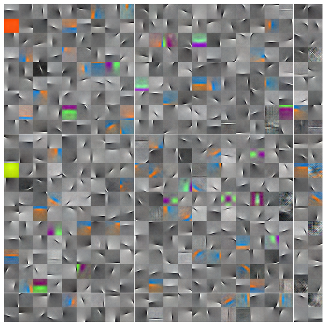

# Lie-Adam

PyTorch implementation of Lie-Adam. 



Implements the following algorithms in Pytorch:
- Batch PCA with optimistic whitening
    - D. Ross, J. Lim, R. Lin, M. Yang, Incremental Learning for Robust Visual 
    Tracking, International Journal of Computer Vision, Volume 77, Issue 1-3,
    pp. 125-141, May 2008. 
    - See https://www.cs.toronto.edu/~dross/ivt/RossLimLinYang_ijcv.pdf
- Improved Lie Group ICA
    - Plumbley, M. D. (2007, April). Geometry and manifolds for independent component analysis. In 2007 IEEE International Conference on Acoustics, Speech and Signal Processing-ICASSP'07 (Vol. 4, pp. IV-1397). 
    - See http://www.eecs.qmul.ac.uk/~markp/2007/Plumbley07-icassp.pdf
- Generalized Hebbian Algorithm
    - Erkki Oja. Simplified neuron model as a principal component analyzer.


### Installation

1. For GIT:
```
git clone https://github.com/matherm/Lie-Adam
```

2. For PIP
```
pip install hugeica.git
```

### Tests

```
pytest tests
```

### Example
```
python examples/sklearn_moons.py  
```
